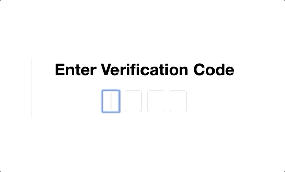

# Ngx-SplitInput


## Usage
1) Install library:

    `npm install --save ngx-splitinput`

2) Import the `NgxSplitInputModule` into your Angular module:

    ```
    import {NgxSplitInputModule} from 'ngx-splitinput';
    
    @NgModule({
      imports: [
        NgxSplitInputModule,
        ...
      ],
      ...
    })
    export class AppModule { }
    ```

3) Use the `NgxSplitInputComponent` in you template as follows:

    ```
    <ngx-split-input>
        <input ngxSplitInput type="text" maxlength="1">
        <input ngxSplitInput type="text" maxlength="1">
        <input ngxSplitInput type="text" maxlength="1">
        <input ngxSplitInput type="text" maxlength="1">
    </ngx-split-input>
    ```

Currently only input elements of type 'text' or 'number' are supported. The `ngxSplitInput` directive has to be places on every input element contained in the SplitInput component. The 'type' and 'maxlength' arguments are required for every input.

For an example implementation see the code of the [Sample App](https://github.com/maxkolb/ngx-splitinput/tree/master/apps/split-input-sample).

## Options
This section describes the inputs of the component. All inputs are optional.

### Inputs
* `autofocus: boolean = true`: If set to `true` the first input element will be focused on page load.
